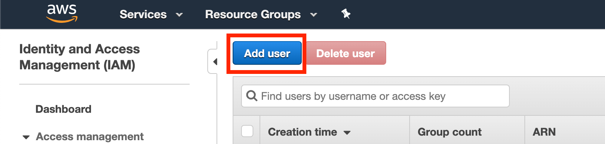
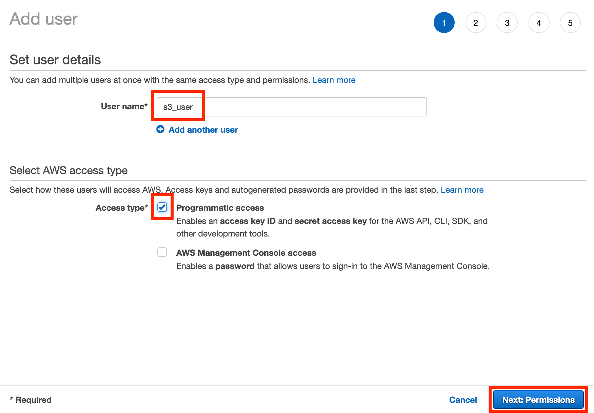
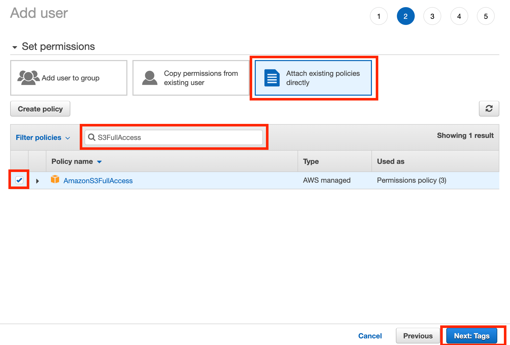
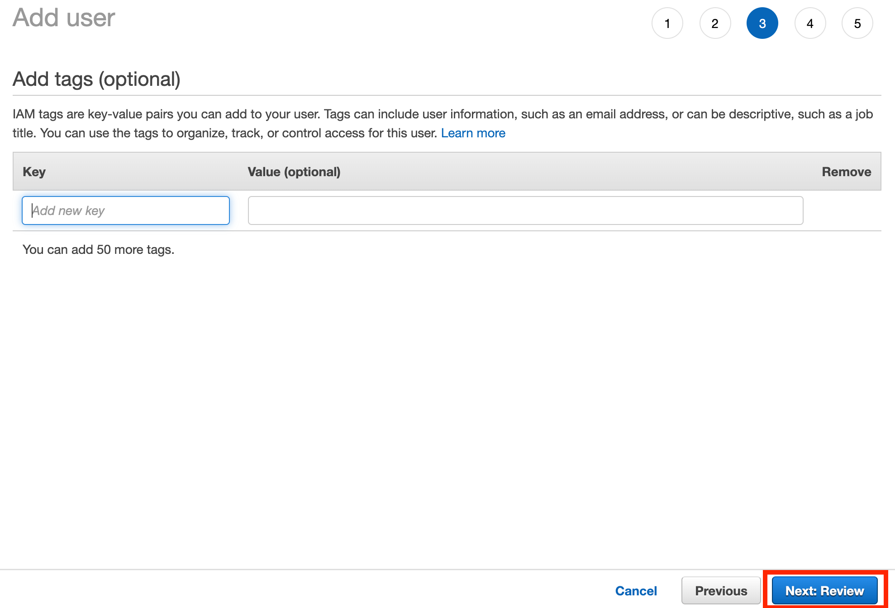
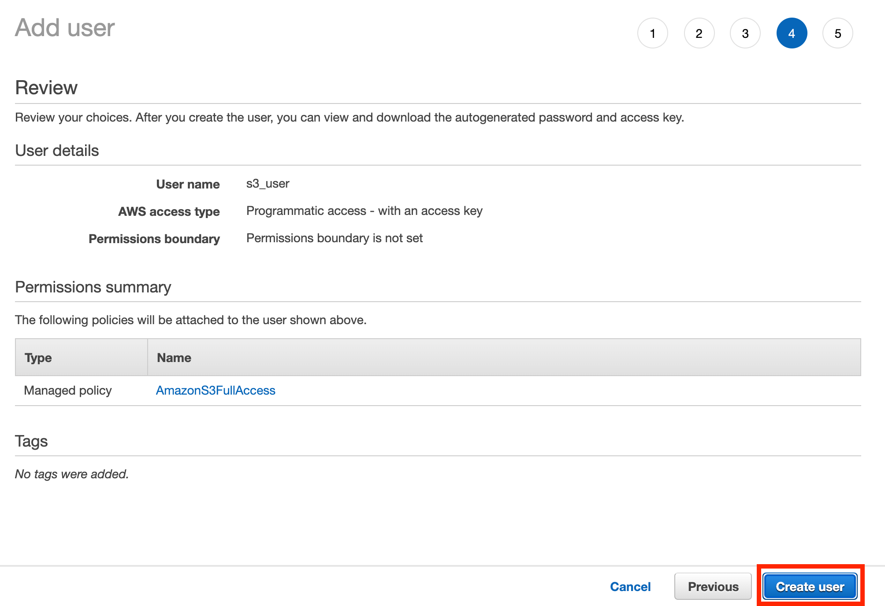
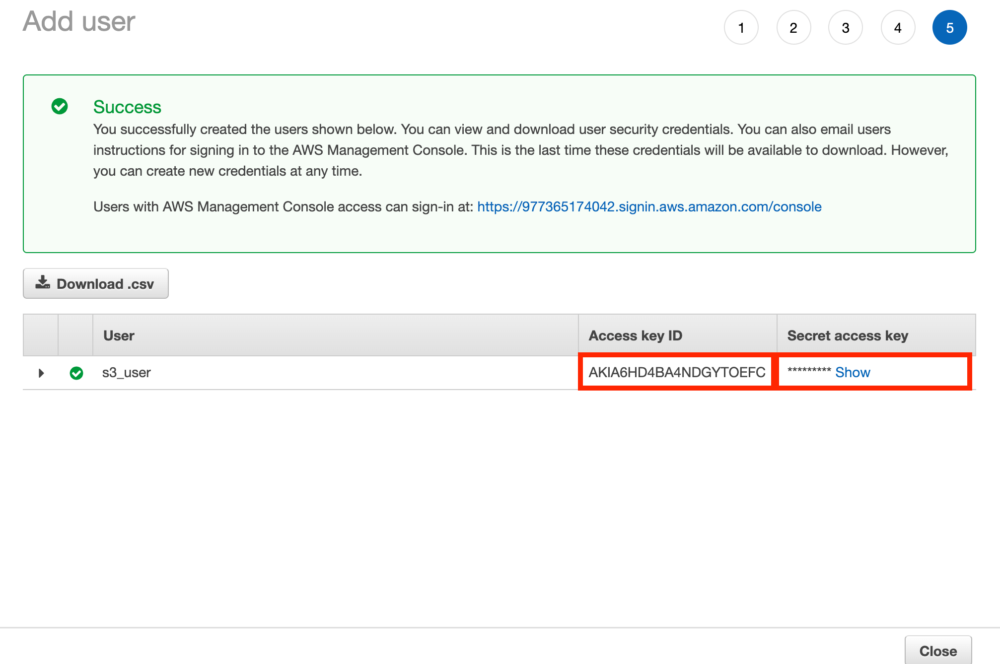
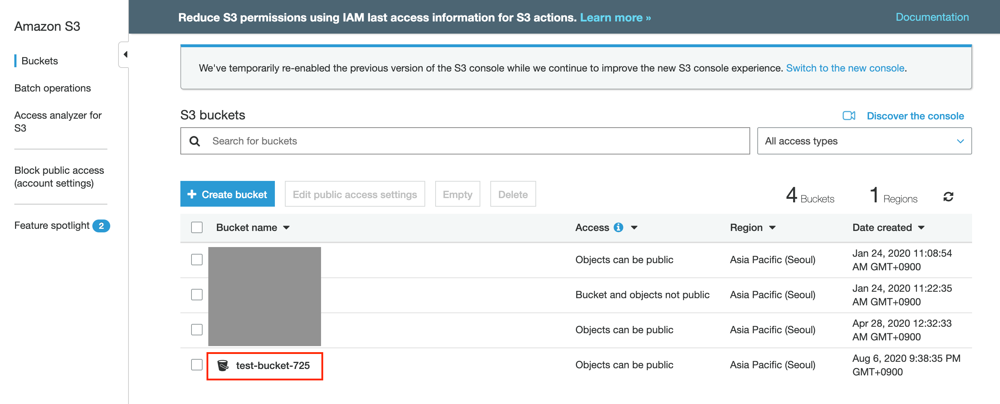
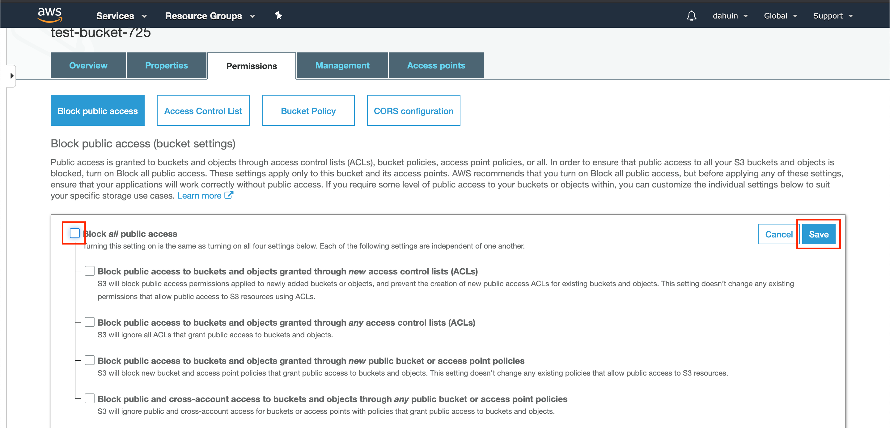

<p align="center">
  <a href="" rel="noopener">
 </a>
 <br>

 
</p>

<h3 align="center">Easy S3</h3>

<div align="center">

[]()
[](https://github.com/kylelobo/The-Documentation-Compendium/issues)
[](https://github.com/kylelobo/The-Documentation-Compendium/pulls)
[](/LICENSE)

</div>

---

<p align="center"> This package helps you use S3 easily.
    <br> 
</p>

## 📝 Table of Contents

- [About](#about)
- [Getting Started](#getting_started)
- [Usage](#usage)
- [Acknowledgments](#acknowledgement)

## 🧐 About <a name = "about"></a>

This package helps you use S3 easily. You can use following functions.

**Default**

* [Save](#save)
* [Load](#load)
* [List](#list)

**Cache**

* [Save Cache](#save_cache)
* [Load Cache](#load_cache)
* [List Cache](#list_cache)

**Others**

* [Save URI](#save_uri)
* [List Directory Names](#list_directory_names)

## 🏁 Getting Started <a name = "getting_started"></a>

### Installing

```
pip install easy_s3
```

<a name="prerequisites"></a>

### Prerequisites 

#### 1. Access Key required for S3 Authentication. If you don't have Access Key, Please follow below steps.

1. Click below URL.

    https://console.aws.amazon.com/iam/home#/users

2. Click `Add user` button.

    

3. Input `User name` and enable `Programmatic access`.

    

4. Click `Attach existing policies directly` and Search `S3FullAccess` and check `AmazonS3FullAccess` and click `Next:Tags`.

    

5. Click `Next:Review`

    

6. click `Create user`
    

7. copy `Access Key ID` and `Secret access Key` to user notepad.

    

8. complete!

#### 2. Bucket required for store asset in S3. Please follow below steps.

1. create bucket. Please refer to URL below

    https://docs.aws.amazon.com/AmazonS3/latest/user-guide/create-bucket.html

2. Click the bucket you just created.

    

3. click `Permissions Tab` and `Uncheck Block all public access`, and click `Save button`.

    


#### 3. You need to know which region your bucket is in. If you don't know yet, Please follow below steps.

1. click [HERE.](https://s3.console.aws.amazon.com/s3/home)

2. Your URL should been changed like this. Remember that region.
    * https://s3.console.aws.amazon.com/s3/home?`region=ap-northeast-2`

#### 4. (Required) Create Handler

Use this code to create handler.

```python
import easy_s3

bucket_name = "Your Bucket Name"

# The service name serves as a detailed classification within the bucket.
# In this situaion, accounts and orders and items are service name.
#   1. default/accounts/Your File Path
#   2. default/orders/Your File Path
#   3. default/items/Your File Path

service_name = "Your Service Name"
region_name = "Your Bucket Region"

# You don't need to use these two parameters if your authentication file is in ~/.aws/config.
aws_access_key_id = "YOUR AWS ACCESS KEY ID"
aws_secret_access_key = "YOUR AWS SECRET ACCESS KEY"

es = easy_s3.EasyS3(bucket_name, service_name, region_name, 
                    aws_access_key_id=aws_access_key_id,
                    aws_secret_access_key=aws_secret_access_key)

print(es)
```

result:
```
<easy_s3.EasyS3 object at 0x10d966278>
```

## 🎈 Usage <a name="usage"></a>

Please check [Prerequisites](#prerequisites) before starting `Usage`.

### 🌱 Save <a name="save"></a>

Use this function to save data into S3. 

The saved path is as follows.

```
default/Your Service Name/Y-M-D/Your File Path
```

**Parameters**

* `(required) path`: str

    ```
    foo/bar/hello.json
    ```

* `(required) value`: dict | list | str | bytes | int | float | ...

    ```python
    {"hello": "world", "yellow", "banana"}
    ```

* `options`: dict
    
    Parameters
    
    * `public`: bool (default: False)
        
        if this value is True, anyone can access it.

    * `ymd`: bool (default: False)

        if this value is True, ymd is entered automatically. 

        ```
        default/Your Service Name/20-08-24/Your File Path
        ```

    * `compress_type`: str (default: None)

        currently only gzip is supported.

    ```python
    {
        "public": True,
        "ymd": True,
        "compress_type": "gzip"
    }
    ```

**Examples**

```python
data = {"name": "apple", "price": "120"}
options = {
        "public": True,
        "ymd": True,
        "compress_type": "gzip"
    }
url = es.save("food/apple.json", data,
    options=options)

print(url)
```

result:

* If you want check file, check your bucket in [S3 console](https://s3.console.aws.amazon.com/s3/home).

```
https://test-bucket-725.s3.ap-northeast-2.amazonaws.com/default/items/2020-08-06/food/apple.json
```

**Returns**

* URL of saved file: `str`

<!-- **Default**

* [Save](#save)
* [Load](#load)
* [List](#list)

**Cache**

* [Save Cache](#save_cache)
* [Load Cache](#load_cache)
* [List Cache](#list_cache)

**Others**

* [Save URI](#save_uri)
* [List Directory Names](#list_directory_names) -->

## 🎉 Acknowledgements <a name = "acknowledgement"></a>

- Title icon made by [Freepik](https://www.flaticon.com/kr/authors/freepik).

- If you have a problem. please make [issue](https://github.com/da-huin/easy_s3/issues).

- Please help develop this project 😀

- Thanks for reading 😄
